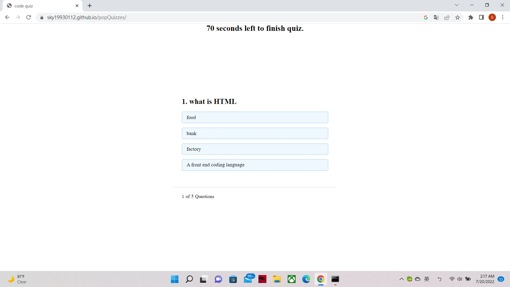

# popQuizzes

*I use HTML to set up structure for Start bottun, question container, and result block.

*In the Javascript, I put on timing function at begin. I tried to use function in timer to set up gameover picture to block the app when time is runiing out; but somehow picture not working.

*Then setup an array for questions.

*Use querySelector to grab HTML classes to setup variables

*I use onclick method to make the bottons work

*I use functions to set up question pop out systems; which I learn a lot from google-ing.

*Final set up an initial input and submit botton

link to deployed application ( https://sky19930112.github.io/popQuizzes )

